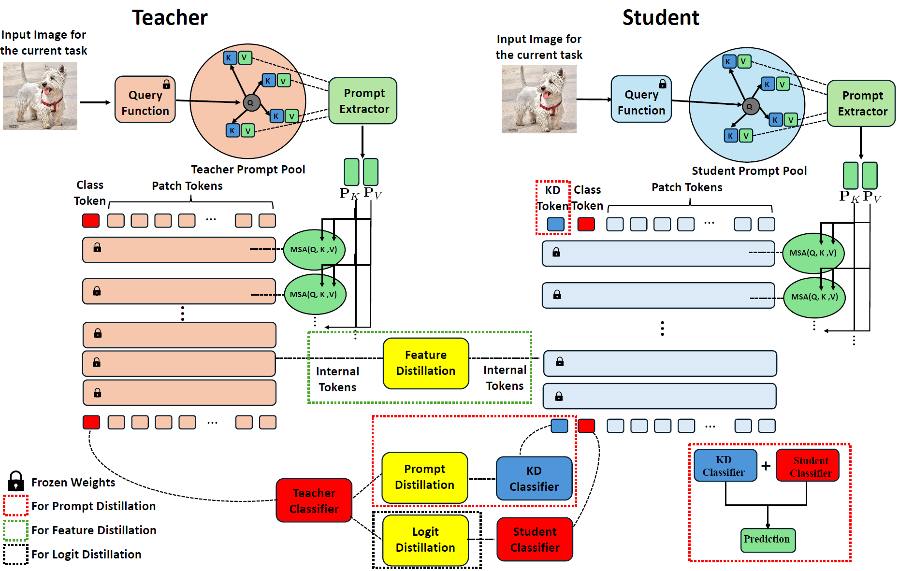

##  Continual Distillation Learning
PyTorch code for the paper:\
**Continual Distillation Learning: An Empirical Study of Knowledge Distillation in Prompt-based Continual Learning**\
Qifan Zhang, Yunhui Guo, Yu Xiang

[arXiv](https://arxiv.org/abs/2407.13911), [Project](https://irvlutd.github.io/CDL/)

<p align="center">

</p>

## Abstract
Knowledge Distillation (KD) focuses on using a teacher model to improve a student model. Traditionally, KD is studied in an offline fashion, where a training dataset is available before learning. In this work, we introduce the problem of Continual Distillation Learning (CDL) that considers KD in the Continual Learning (CL) setup. A teacher model and a student model need to learn a sequence of tasks, and the knowledge of the teacher model will be distilled to the student to improve the student model in an online fashion. The CDL problem is valuable to study since for prompt-based continual learning methods, using a larger vision transformer (ViT) leads to better performance in continual learning. Distilling the knowledge from a large ViT to a small ViT can improve inference efficiency for promptbased CL models. To this end, we conducted experiments to study the CDL problem with three prompt-based CL models, i.e., L2P, DualPrompt and CODA-Prompt, where we utilized logit distillation, feature distillation and prompt distillation for knowledge distillation from a teacher model to a student model. Our findings of this study can serve as baselines for future CDL work.


## Setup
 * Install anaconda: https://www.anaconda.com/distribution/
 * set up conda environment w/ python 3.8, ex: `conda create --name CDL python=3.8`
 * `conda activate CDL`
 * `sh install_requirements.sh`
 * <b>NOTE: this framework was tested using `torch == 2.0.0` but should work for previous versions</b>
 
## Datasets
 * Create a folder `data/`
 * **CIFAR 100**: should automatically be downloaded
 * **ImageNet-R**: retrieve from: https://github.com/hendrycks/imagenet-r

## Training
All commands should be run under the project root directory. **The scripts are set up for 2 GPUs** but can be modified for your hardware.

```bash
sh experiments/cifar100.sh
sh experiments/imagenet-r.sh
```
Or you can directly run the run.py and test on ImageNet-R dataset:

```bash
python -u run.py --config configs/imnet-r_prompt.yaml --overwrite 0 \
    --learner_type prompt --learner_name CODAPrompt \
    --prompt_param 100 8 0.0 \
    --log_dir Demo_test/coda-p \
    --t_model 'vit_base_patch16_224' \
    --s_model 'vit_small_patch16_224' \
    --random_s 1 \
    --KD_method 'KD_Token'
```

* You can change the learner_name for DualPrompt or L2P.(And change the prompt_param for different learner. Check the imagenet-r.sh)
* You can adjust the teacher and student's model with --t_model and --s_model.
* Change the --random_s(random seed) for different results.
* Change the --KD_method for different knowledage distillation methods -> ['KD_Token', 'KD', 'DKD', 'FitNets', 'ReviewKD']


## Results

The results will be saved in the created --log_dir folder, including the models for the teacher and student as well as the final average accuracy for both the teacher and student.

<!-- ## Citation
If you find the method useful in your research, please consider citing:
```latex
@misc{lu2024adapting,
    title={Continual Distillation Learning},
    author={Qifan Zhang and Yunhui Guo and Yu Xiang},
    year={2024},
    eprint={2407.13911},
    archivePrefix={arXiv},
    primaryClass={cs.CV}
}
``` -->

## Acknowledgments

This project is based on the following repositories:
- [CODA-Prompt](https://github.com/GT-RIPL/CODA-Prompt)
- [L2P-Pytorch](https://github.com/JH-LEE-KR/l2p-pytorch)


